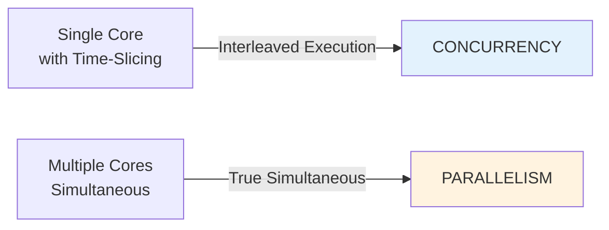
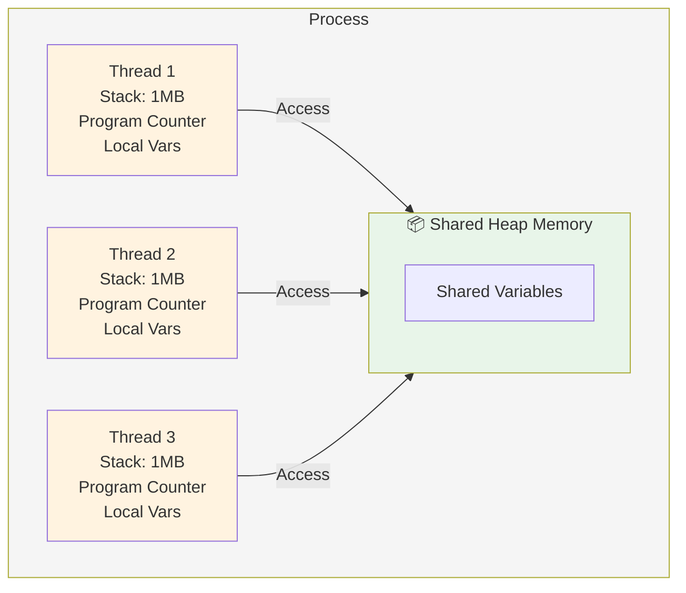
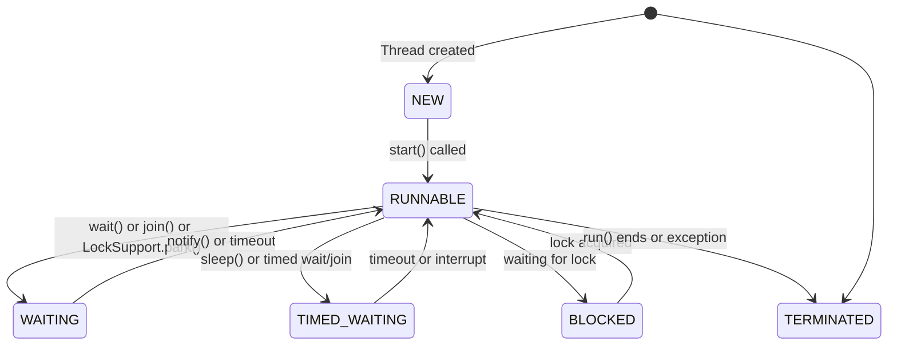

# 01 · Concurrency vs Parallelism & Process vs Thread

> **Level:** Beginner
> 
> **Context:** These are foundational concepts that everything else builds upon. Misunderstanding these leads to confusion about when and where to use Java's concurrency tools.

---

## Concurrency vs Parallelism

### Concurrency

**Definition**: Concurrency is the *ability* to manage multiple tasks simultaneously by having the program work on multiple tasks in an interleaved fashion, not necessarily executing them at the exact same moment.

**Visual representation:**

```
Concurrency (Single Core with Time-Slicing):

Thread 1 (Read Email)  |███| ___| ███|___| ███|
Thread 2 (Download)    |___| ███| ___| ███|___| time →
                       t=0  t=1  t=2  t=3  t=4
```

**Key characteristics:**

- Happens on a **single CPU core** through time-slicing
- Threads take turns executing
- Context switching overhead
- **Focus**: Responsiveness and resource efficiency
- Example: Web server handling 1000 connections with 100 threads

### Parallelism

**Definition**: Parallelism is the act of executing multiple tasks *simultaneously* on multiple CPU cores, truly running them at the same instant.

**Visual representation:**

```
Parallelism (Multi-Core, True Simultaneous Execution):

Core 1 (Thread 1) |████████████| → Task 1
Core 2 (Thread 2) |████████████| → Task 2
                  time →
```

**Key characteristics:**

- Requires **multiple CPU cores**
- **No true parallelism on single core**
- Example: Matrix multiplication split across 4 cores on a 4-core CPU

### Visual Comparison



### Which One Do You Need?

| Goal | Concurrency | Parallelism |
|:-----|:------------|:-----------|
| **Web server** (many I/O tasks) | ✅ Primary | ❌ Secondary |
| **Data processing** (CPU-bound tasks) | ❌ Not main focus | ✅ Primary |
| **UI responsiveness** | ✅ Essential | ❌ Not essential |
| **Database connection pooling** | ✅ Essential | ❌ Not needed |

---

## Process vs Thread

### Process

**Definition**: A process is a **fully isolated, independent execution context** started by the OS, with its own memory space, file descriptors, and resources.

**Characteristics:**

```java
// Starting a new process (OS-level)
ProcessBuilder pb = new ProcessBuilder("java", "-jar", "app.jar");
Process process = pb.start();  // New OS process
```

| Aspect | Detail |
|:-------|:-------|
| **Memory** | Separate, isolated address space (typically 50MB minimum) |
| **Resources** | Own file handles, sockets, pipes |
| **Cost** | Expensive to create (~50ms) |
| **Communication** | Inter-Process Communication (IPC) — slow, like pipes or sockets |
| **Isolation** | One process crash doesn't affect others |
| **Number** | Limited to hundreds on a system |

### Thread

**Definition**: A thread is a **lightweight execution context** within a process, sharing memory and resources with other threads in the same process.

**Characteristics:**

```java
// Starting a new thread (JVM-level)
Thread thread = new Thread(() -> System.out.println("Running in thread"));
thread.start();  // New JVM thread
```

| Aspect | Detail |
|:-------|:-------|
| **Memory** | Shared heap with other threads (~1MB stack per platform thread) |
| **Resources** | Shared file handles, sockets, connections |
| **Cost** | Cheap to create (~1ms) |
| **Communication** | Direct memory sharing (fast, risky) |
| **Isolation** | Shared memory means one thread can corrupt another's data |
| **Number** | Thousands possible in a single process |

### Process vs Thread — Visual Comparison



### Memory Layout

**Single Process with Multiple Threads:**

```
Process Memory Layout:
┌─────────────────────────────┐
│  HEAP (Shared)              │  ← All threads access here
│  ┌─────────────────────────┐│
│  │ Static Variables        ││
│  ├─────────────────────────┤│
│  │ Objects                 ││
│  ├─────────────────────────┤│
│  │ String Literal Pool     ││
│  └─────────────────────────┘│
├─────────────────────────────┤
│  Thread 1 Stack (1MB)       │  ← Local to Thread 1
│  ┌─────────────────────────┐│
│  │ Local Variables         ││
│  │ Stack Frames            ││
│  └─────────────────────────┘│
├─────────────────────────────┤
│  Thread 2 Stack (1MB)       │  ← Local to Thread 2
│  ┌─────────────────────────┐│
│  │ Local Variables         ││
│  │ Stack Frames            ││
│  └─────────────────────────┘│
├─────────────────────────────┤
│  Code Section (readonly)    │
└─────────────────────────────┘
```

---

## Thread States & Lifecycle

### Thread States

A Java thread can exist in one of these states:



**States explained:**

| State | Meaning | Example |
|:------|:--------|:--------|
| **NEW** | Created but not yet started | `Thread t = new Thread(...)` |
| **RUNNABLE** | Ready to run or currently running | After `start()` called |
| **BLOCKED** | Waiting to acquire a lock | Inside `synchronized` block |
| **WAITING** | Indefinitely waiting to be woken | After `wait()` or `join()` |
| **TIMED_WAITING** | Waiting with a timeout | After `sleep()` or timed `wait()` |
| **TERMINATED** | Finished execution | `run()` completed or exception |

---

## Key Takeaways

- **Concurrency**: Multiple tasks making progress (even on single core)
- **Parallelism**: Simultaneous execution (requires multiple cores)
- **Processes**: OS-level isolation, expensive to create
- **Threads**: JVM-level, lightweight, share memory
- **Memory model**: Shared heap, separate stacks per thread
- **Thread states**: NEW → RUNNABLE → (BLOCKED/WAITING/TIMED_WAITING) → TERMINATED

---

## Common Misconceptions

❌ **"More threads = faster execution"** 
→ True only if you have enough cores. Threads compete for CPU time.

❌ **"Concurrency = Parallelism"** 
→ You can have concurrency without parallelism (single core with many threads).

❌ **"Threads are free to create"** 
→ Each platform thread costs ~1MB memory. 10,000 threads = ~10GB RAM.

❌ **"All shared data access is a race condition"** 
→ Only non-atomic, unsynchronized access is risky.

---

## 📚 Read the Original Blog Post

For more details and examples, read the full blog series:

- **[Series Overview](https://nitinkc.github.io/java/multithreading/concurrency/series-overview/)** — Complete roadmap
- **[Theory & Fundamentals](https://nitinkc.github.io/java/multithreading/concurrency/01-theory-and-fundamentals/)** — Comprehensive foundations

---

??? question "What's the difference between concurrency and parallelism?"
    Concurrency is managing multiple tasks (time-sliced on single core). Parallelism is executing multiple tasks simultaneously (multiple cores). You can have concurrency without parallelism, but not parallelism without concurrency.

??? question "Why do we need threads if we have processes?"
    Threads are cheaper to create, faster to context-switch, and share memory efficiently. Processes provide better isolation and crash protection at the cost of higher overhead.

??? question "Can a single-core system achieve parallelism?"
    No. Parallelism requires simultaneous execution on multiple cores. A single-core system can only achieve concurrency through time-slicing.

---
