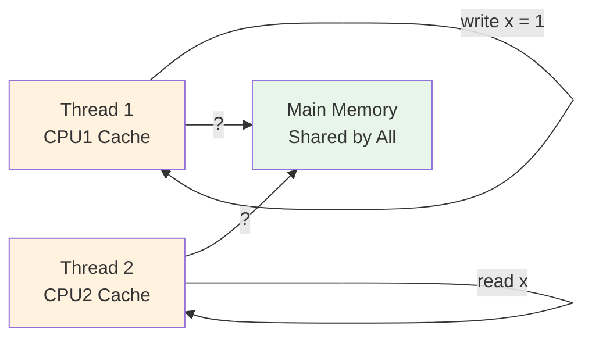
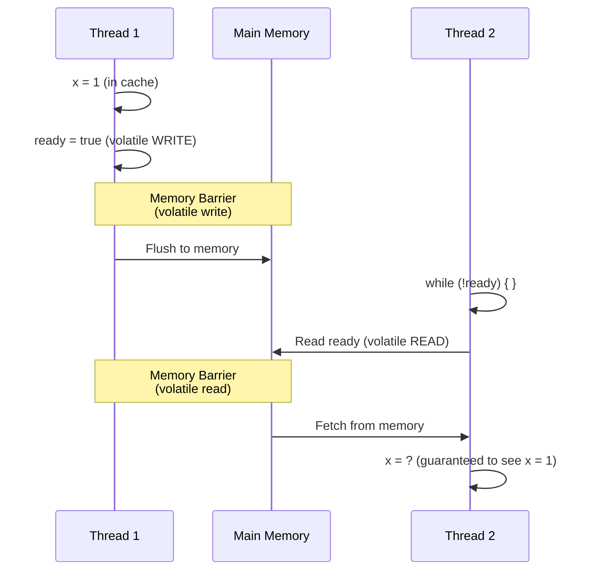

# 02 · Java Memory Model & Memory Visibility

> **Level:** Beginner
>
> **Pre-reading:** [01 · Concurrency vs Parallelism](01-foundations-concurrency.md)

---

## The Java Memory Model (JMM)

### What Is the Java Memory Model?

The **Java Memory Model** is a specification that defines how threads interact through memory. It ensures that even on systems with multiple CPUs with different cache architectures, Java code behaves predictably.

**Problem it solves:**

- Without JMM: Each CPU has private caches; changes in one thread might not be visible to others
- With JMM: Clear rules about when writes become visible to other threads



### The Problem: Visibility

Without proper synchronization, changes made by one thread might not be visible to another:

```java
class SharedResource {
    boolean ready = false;
    int value = 0;
    
    void prepare() {
        value = 42;
        ready = true;      // Thread 1 writes
    }
    
    void use() {
        while (!ready) { }  // Thread 2 might see old value!
        System.out.println(value);  // Could print 0 instead of 42
    }
}
```

This is a **visibility problem** — Thread 2 sees a cached/stale value.

---

## Happens-Before Relationship

The JMM defines **happens-before** relationships. If Action A happens-before Action B, then:

- All effects of A are visible before B starts
- The JVM won't reorder them

### Key Happens-Before Rules

| Rule | Example |
|:-----|:--------|
| **Program Order** | Within a thread: statement 1 happens-before statement 2 |
| **Volatile** | Write to volatile  → Read of same volatile |
| **synchronized** | Exit from lock happens-before entry to same lock |
| **start()** | Thread.start() happens-before anything in new thread |
| **join()** | All statements in thread happen-before join() returns |
| **Memory barrier** | volatile reads/writes create memory barriers |

### Visual: Happens-Before in Progress



---

## Visibility Issues & Solutions

### Before: Data Race (Broken)

```java
class Counter {
    private int count = 0;  // Shared, NOT volatile
    
    void increment() {
        count++;  // Read → Increment → Write (not atomic)
    }
    
    int getCount() {
        return count;  // May see stale value
    }
}

// Usage
Counter counter = new Counter();
new Thread(() -> {
    for (int i = 0; i < 1000000; i++) {
        counter.increment();  // Thread 1
    }
}).start();

new Thread(() -> {
    for (int i = 0; i < 1000000; i++) {
        counter.increment();  // Thread 2
    }
}).start();

// Result: count is NOT 2000000 (race condition!)
```

### Solution 1: Synchronized

```java
class Counter {
    private int count = 0;
    
    synchronized void increment() {  // Synchronization ensures visibility
        count++;
    }
    
    synchronized int getCount() {
        return count;
    }
}

// Result: Correct, but slower (lock overhead)
```

### Solution 2: Volatile

```java
class Counter {
    private volatile int count = 0;  // volatile ensures visibility
    
    void increment() {
        count++;  // Still NOT atomic! Can lose updates
    }
    
    int getCount() {
        return count;  // Sees latest value
    }
}

// Result: Visibility guaranteed, but increment still not atomic!
// Final count may still be < 2000000
```

### Solution 3: Atomic Types

```java
import java.util.concurrent.atomic.AtomicInteger;

class Counter {
    private AtomicInteger count = new AtomicInteger(0);
    
    void increment() {
        count.incrementAndGet();  // Atomic + visible
    }
    
    int getCount() {
        return count.get();
    }
}

// Result: Correct! Both atomic and visible.
```

---

## Memory Barriers

### What Are Memory Barriers?

Memory barriers are **low-level CPU instructions** that enforce ordering and visibility of memory operations.

**Types:**

| Type | Effect |
|:-----|:-------|
| **Load Barrier** | Ensures all loads after this are from memory (not cache) |
| **Store Barrier** | Ensures all stores before this are flushed to memory |
| **Full Barrier** | Both load and store barriers |

**When they occur:**

- `volatile` read = Load barrier
- `volatile` write = Store barrier
- Lock `acquire` = Load barrier
- Lock `release` = Store barrier

```java
// Pseudo-code showing barriers
volatile boolean flag = false;

void write() {
    x = 1;
    flag = true;           // ← Store barrier here
    // Ensures x = 1 is visible before flag = true
}

void read() {
    if (flag) {            // ← Load barrier here
        // Ensures we see latest value of flag
        // Also ensures x is visible
        System.out.println(x);  // Guaranteed to see x = 1
    }
}
```

---

## Reordering

The JMM **allows reordering** as long as it doesn't violate happens-before relationships.

### Code Reordering Example

```java
int x = 0, y = 0;

Thread 1:                    Thread 2:
x = 1;        // (1)        int r1 = y;  // (3)
y = 1;        // (2)        int r2 = x;  // (4)

// Possible results (NO reordering):
// r1 = 1, r2 = 0 (T2 reads before T1 writes)
// r1 = 1, r2 = 1 (T2 reads after T1 writes)
// r1 = 0, r2 = 0 (T2 is very fast)

// Reordering can cause:
// r1 = 0, r2 = 0 (Line 2 executes before line 1 in Thread 1)
// This is valid because: no happens-before rule prevents it
```

**Fix with volatiles:**

```java
volatile int x = 0;
volatile int y = 0;

Thread 1:
x = 1;  // Volatile write = Store barrier
y = 1;  // Stop. Must wait for store barrier from x

Thread 2:
int r1 = y;  // Volatile read = Load barrier
int r2 = x;  // Now r1 = 1, r2 = 1 guaranteed
```

---

## Key Takeaways

| Concept | Rule |
|:--------|:-----|
| **Visibility** | Without sync, changes from one thread may not be seen by others |
| **Happens-Before** | Defines ordering and visibility guarantees |
| **synchronized** | Ensures both atomicity AND visibility |
| **volatile** | Ensures visibility but NOT atomicity |
| **Memory Barriers** | Low-level mechanism ensuring reordering respects happens-before |
| **Reordering** | JVM may reorder code as long as it respects happens-before |

---

## 📚 Read the Original Blog Post

For more details and examples, read:

- **[Theory & Fundamentals](https://nitinkc.github.io/java/multithreading/concurrency/theory-and-fundamentals/)** — Java Memory Model deep dive

---

??? question "Why do we need volatile if synchronized exists?"
    synchronized is heavier (lock overhead). volatile is lighter when you only need visibility without atomicity (e.g., flag variables).

??? question "Is reading a volatile variable slow?"
    It's slightly slower than a regular read because it inserts memory barriers, but it's usually acceptable for flags, references, or immutable data.

??? question "Does volatile make operations atomic?"
    No. volatile ensures visibility but not atomicity. `volatile count++` is still a data race.

---
