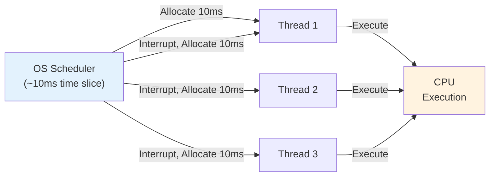

# 03 · I/O Types & Thread Preemption

> **Level:** Beginner
>
> **Pre-reading:** [01 · Concurrency vs Parallelism](01-foundations-concurrency.md)

---

## I/O Types

### Blocking I/O (Traditional)

**Definition**: The calling thread **waits** (blocks) until the I/O operation completes.

```java
// Blocking I/O — Thread waits for socket read to complete
Socket socket = new Socket("example.com", 80);
InputStream input = socket.getInputStream();
byte[] buffer = new byte[1024];

int bytesRead = input.read(buffer);  // BLOCKS until data arrives
System.out.println("Read: " + bytesRead);
```

**Timeline:**

```
Thread: |─────[BLOCKED waiting for read]─────| Ready → Continues
Time:   t=0                                 t=500ms
        ↑                                   ↑
        read() called                       Data arrives, unblocks
```

**Characteristics:**

- Thread **cannot do anything else** while waiting
- Simple to program
- Requires one thread per request (limited scalability)
- Example: Traditional web server with thread-per-request

**Problem with many connections:**

```
1000 Connections:
T1: read() from Socket 1 [BLOCKED]
T2: read() from Socket 2 [BLOCKED]
T3: read() from Socket 3 [BLOCKED]
...
T1000: read() from Socket 1000 [BLOCKED]

Memory: 1000 threads × 1MB stack = ~1GB just for stacks!
CPU: Context switching overhead with 1000 threads
```

### Non-Blocking I/O (Modern)

**Definition**: Calling thread **does not wait**. Returns immediately with whatever is available.

```java
// Non-blocking I/O — Never blocks
SocketChannel channel = SocketChannel.open();
channel.configureBlocking(false);  // Non-blocking mode

ByteBuffer buffer = ByteBuffer.allocate(1024);
int bytesRead = channel.read(buffer);  // Returns immediately!

if (bytesRead == 0) {
    System.out.println("No data available right now");
    // Thread can do other work
} else {
    System.out.println("Read: " + bytesRead);
}
```

**Timeline:**

```
Thread: |─[check]─| [check]─| [check]─| [check]─| [check]─| ✓ [process]
Time:   t=0  t=100 t=200     t=300     t=400     t=500     t=501
        Polling (busy-waiting)              Data available, thread processes
```

**Characteristics:**

- Thread **never blocks**, always returns immediately
- Allows multiplexing (one thread handles many connections)
- More complex programming model
- Requires polling or event notification
- Example: Using `java.nio.Selector` for I/O multiplexing

### Comparison

| Aspect | Blocking | Non-Blocking |
|:-------|:---------|:------------|
| **Thread waits?** | Yes (blocked) | No (returns immediately) |
| **Memory per connection** | ~1MB thread stack | ~10KB per selector |
| **Max connections** | Hundreds | Tens of thousands |
| **Complexity** | Simple | Complex |
| **Latency** | Depends on when OS schedules | Depends on polling frequency |
| **CPU usage** | Idle during I/O | Active polling (can waste CPU) |

### Asynchronous I/O (Java 21+)

**Definition**: Register interest in I/O completion, get notified when done.

```java
// Asynchronous I/O with CompletableFuture
CompletableFuture<String> future = CompletableFuture.supplyAsync(() -> {
    try {
        // Blocking read happens in separate thread
        Socket socket = new Socket("example.com", 80);
        // ... read data ...
        return "Data";
    } catch (Exception e) { throw new RuntimeException(e); }
});

// Main thread continues
System.out.println("Sent request, continuing...");

// Later, when ready:
future.thenAccept(data -> System.out.println("Got: " + data));
```

---

## Thread Preemption

### What Is Preemption?

**Preemption**: The OS scheduler can **forcibly pause** a running thread and switch to another thread, even if the first thread hasn't finished.

**Characteristics:**

- Not cooperative (thread doesn't yield voluntarily)
- Thread can be **interrupted at any instruction**
- Critical sections protected by synchronization
- Preemption time: microseconds to milliseconds

### Preemptive Scheduling in Java



### Time-Slicing

`Each thread gets** ~10ms (default, OS-dependent) to run, then gets preempted.

```java
long startTime = System.currentTimeMillis();

// Thread 1: Heavy computation
new Thread(() -> {
    while (System.currentTimeMillis() - startTime < 100) {
        // Runs ~10ms, then OS preempts
        // Another thread gets ~10ms
    }
}).start();

// Thread 2: Also heavy computation
new Thread(() -> {
    while (System.currentTimeMillis() - startTime < 100) {
        // Runs ~10ms, then OS preempts
    }
}).start();

// Both threads appear to run in parallel, but actually interleaving
```

### Context Switching Overhead

Every time the OS switches threads:

1. Save current thread state (registers, program counter, stack pointer)
2. Load new thread state
3. Flush CPU caches (cache misses)
4. TLB (Translation Lookaside Buffer) misses

```
Context Switch Cost:

- Save/Load state: ~0.5 microseconds
- Cache flushing: ~1-10 microseconds
- Total per switch: ~10-100 microseconds

With 1000 threads:

- Switching every 10ms means P = 1000 * 10-100 microseconds = 10-100ms overhead per full rotation
```

**Impact on scalability:**

```
Throughput vs Thread Count:
Throughput  │     ╱─────── (plateau: context switch overhead dominates)
            │    ╱│
            │   ╱ │ Optimal point (e.g., 4-8 threads on 4-core CPU)
            │  ╱  │
            │ ╱   │
            ├─────┼───────→ Thread Count
            0     4    8    12   16   20
```

###Virtual Threads Reduce Preemption Cost

Java 21+ **virtual threads** don't suffer from typical preemption overhead:

- 1 million virtual threads are possible (vs ~1000 platform threads)
- No expensive context switching between virtual threads
- JVM scheduler is more efficient than OS scheduler

---

## Choosing the Right I/O Model

### Use Blocking I/O If:
- ✅ Few concurrent requests
- ✅ Simplicity is critical
- ✅ Each request takes time (can dedicate a thread)

**Example: Traditional microservice with 100 concurrent users**

```java
ExecutorService executor = Executors.newFixedThreadPool(100);
ServerSocket serverSocket = new ServerSocket(8080);

while (true) {
    Socket client = serverSocket.accept();  // Blocking
    executor.submit(() -> handleClient(client));  // Blocking I/O in thread
}
```

### Use Non-Blocking I/O If:
- ✅ High concurrency (thousands of connections)
- ✅ Multiplexing many requests on few threads
- ✅ Low latency requirements
- ⚠️ Complex to implement

**Example: Handling 10,000 websocket connections**

```java
Selector selector = Selector.open();
ServerSocketChannel serverChannel = ServerSocketChannel.open();
serverChannel.configureBlocking(false);
serverChannel.register(selector, SelectionKey.OP_ACCEPT);

while (true) {
    selector.select();  // Wait for any I/O event
    for (SelectionKey key : selector.selectedKeys()) {
        // Handle readable, writable channels
    }
}
```

### Use Async I/O (Virtual Threads) If:
- ✅ Java 21+
- ✅ Want simplicity of blocking with scalability of async
- ✅ I/O-bound workloads

**Example: Same 10,000 connections with simpler code**

```java
try (var executor = Executors.newVirtualThreadPerTaskExecutor()) {
    while (true) {
        Socket client = serverSocket.accept();  // Blocking (in virtual thread)
        executor.submit(() -> blockingHandleClient(client));
        // Scales to millions because virtual threads are cheap
    }
}
```

---

## Key Takeaways

| Term | Meaning | Use Case |
|:-----|:--------|:--------|
| **Blocking I/O** | Thread waits for I/O | Few connections, simplicity needed |
| **Non-Blocking I/O** | Thread never waits, polls | High concurrency, low latency |
| **Async I/O** | Notification-based | Modern Java, clean code |
| **Preemption** | OS forcibly switches threads | Fair thread scheduling |
| **Context Switch** | Save/load thread state | Overhead increases with thread count |

---

## 📚 Read the Original Blog Post

For more details and examples, read:

- **[Theory & Fundamentals](https://nitinkc.github.io/java/multithreading/concurrency/theory-and-fundamentals/)** — I/O types and preemption

---

??? question "Why is blocking I/O problematic with many connections?"
    Blocking I/O requires one thread per connection, and threads are expensive (~1MB each). 10,000 connections = ~10GB RAM just for stacks. Non-blocking I/O multiplexes many connections on few threads.

??? question "Does virtual thread preemption have less overhead?"
    Virtual threads don't preempt at the OS level. The JVM scheduler manages them, so switching between millions of virtual threads is much cheaper than OS context switching.

??? question "When is non-blocking I/O worth the complexity?"
    When you need to handle thousands of concurrent connections on limited resources. For <100 connections, blocking I/O is simpler and sufficient.

---
