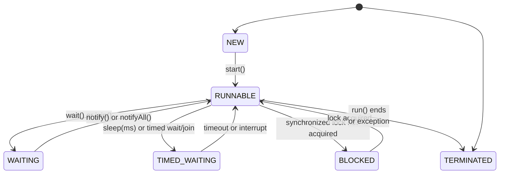

# 04 · Thread Creation & Lifecycle

> **Level:** Beginne
>
> **Pre-reading:** [01 · Concurrency vs Parallelism](01-foundations-concurrency.md)

---

## Runnable vs Callable

### Runnable (Traditional)

```java
@FunctionalInterface
public interface Runnable {
    void run();  // No return value, no checked exceptions
}
```

**Characteristics:**

- ❌ No return value
- ❌ Cannot throw checked exceptions
- ✅ Used with `Thread` directly
- ✅ Used with `ExecutorService`

**Usage:**

```java
// with Thread
Runnable task = () -> System.out.println("Running");
Thread thread = new Thread(task);
thread.start();

// with ExecutorService
ExecutorService executor = Executors.newFixedThreadPool(4);
executor.submit(() -> System.out.println("Task"));
executor.shutdown();
```

### Callable (Modern, Preferred for Tasks)

```java
@FunctionalInterface
public interface Callable<V> {
    V call() throws Exception;  // Returns V, can throw Exception
}
```

**Characteristics:**

- ✅ Returns a value of type `V`
- ✅ Can throw checked exceptions
- ❌ Cannot use with `Thread` directly
- ✅ Used with `ExecutorService`

**Usage:**

```java
// Returns result
Callable<Integer> task = () -> {
    Thread.sleep(100);
    return 42;  // Return value
};

ExecutorService executor = Executors.newFixedThreadPool(4);
Future<Integer> future = executor.submit(task);

try {
    Integer result = future.get();  // Waits for result
    System.out.println("Result: " + result);
} catch (ExecutionException e) {
    // Exception thrown in task
}
```

### Comparison

| Feature | Runnable | Callable |
|:--------|:---------|:---------|
| **Method** | `void run()` | `V call()` |
| **Return** | None | Returns V |
| **Checked Except** | Cannot throw | Can throw |
| **With Thread** | ✅ | ❌ |
| **With Executor** | ✅ | ✅ |
| **For computations** | ❌ | ✅ |

---

## Thread Creation Methods

### Method 1: Extending Thread (❌ Not Recommended)

```java
class MyThread extends Thread {
    @Override
    public void run() {
        System.out.println("Thread running: " + getName());
    }
}

// Usage
Thread thread = new MyThread();
thread.start();
```

**Problems:**

- ❌ Java doesn't support multiple inheritance
- ❌ Inflexible: if you extend `Thread`, you can't extend another class
- ✅ Only use if absolutely necessary

### Method 2: Implementing Runnable (✅ Preferred)

```java
class MyTask implements Runnable {
    @Override
    public void run() {
        System.out.println("Task running: " + Thread.currentThread().getName());
    }
}

// Usage
Thread thread = new Thread(new MyTask());
thread.start();

// Or with lambda (Java 8+)
Thread thread2 = new Thread(() -> {
    System.out.println("Task running");
});
thread2.start();
```

**Advantages:**

- ✅ Can extend other classes
- ✅ More flexible design
- ✅ Separates task logic from thread mechanism

### Method 3: ExecutorService (✅ Most Modern)

```java
ExecutorService executor = Executors.newFixedThreadPool(4);

// Submit Runnable
executor.submit(() -> {
    System.out.println("Task 1");
});

// Submit Callable with return value
Future<String> future = executor.submit(() -> {
    return "Task 2 result";
});

executor.shutdown();
String result = future.get();
```

**Advantages:**

- ✅ Automatic thread pool management
- ✅ Better resource usage
- ✅ Easy to submit many tasks
- ✅ Can retrieve results with `Future`

### Method 4: Thread Factory Pattern (Utility Version)

```java
// Named thread creation
Thread thread = Thread.ofPlatform()
    .name("worker-1")
    .start(() -> {
        System.out.println("Running in: " + Thread.currentThread().getName());
    });

// Virtual thread (Java 21+)
Thread vthread = Thread.ofVirtual()
    .name("virtual-1")
    .start(() -> {
        System.out.println("Virtual thread");
    });
```

---

## Thread Lifecycle

### State Diagram



### State Descriptions

| State | Code | Meaning |
|:------|:-----|:--------|
| **NEW** | `Thread t = new Thread(...)` | Created, not started |
| **RUNNABLE** | `t.start()` | Ready or running |
| **BLOCKED** | Inside `synchronized` | Waiting for lock |
| **WAITING** | `t.wait()` or `join()` | Indefinite wait |
| **TIMED_WAITING** | `sleep(ms)` | Waiting with timeout |
| **TERMINATED** | `run()` ends | Finished |

### Code Example

```java
Thread thread = new Thread(() -> {
    System.out.println("State: " + Thread.currentThread().getState());
    // RUNNABLE
});
System.out.println("State before start: " + thread.getState());  // NEW

thread.start();
System.out.println("State after start: " + thread.getState());  // RUNNABLE (or TERMINATED)

try {
    Thread.sleep(100);
} catch (InterruptedException e) {
    Thread.currentThread().interrupt();
}
System.out.println("Final state: " + thread.getState());  // TERMINATED
```

---

## Thread Naming and Identification

### Getting Thread Info

```java
Thread current = Thread.currentThread();

System.out.println("Name: " + current.getName());      // Thread-0, Thread-1, etc.
System.out.println("ID: " + current.getId());          // Unique long ID
System.out.println("Priority: " + current.getPriority()); // 1-10
System.out.println("Is Alive: " + current.isAlive());  // true if running
System.out.println("Is Daemon: " + current.isDaemon()); // true if daemon
System.out.println("State: " + current.getState());    // RUNNABLE, etc.
```

### Setting Thread Names

```java
Thread thread = new Thread(() -> {
    System.out.println("Running in: " + Thread.currentThread().getName());
});

thread.setName("my-worker-thread");
thread.start();
// Output: Running in: my-worker-thread
```

---

## Daemon vs Non-Daemon Threads

### Non-Daemon Threads (Default)

Non-daemon threads are "important threads". The JVM **waits for all non-daemon threads to finish** before exiting.

```java
Thread nonDaemon = new Thread(() -> {
    for (int i = 0; i < 5; i++) {
        System.out.println("Non-daemon: " + i);
        try { Thread.sleep(1000); } catch (InterruptedException e) {}
    }
});

nonDaemon.setDaemon(false);  // Explicit (default anyway)
nonDaemon.start();

// Main thread finishes, but JVM waits for nonDaemon to finish
System.out.println("Main finished");
// Output:
// Main finished
// Non-daemon: 0
// (waits 1 second)
// Non-daemon: 1
// ... 4
// (JVM exits once all non-daemon threads finish)
```

### Daemon Threads

Daemon threads are "background threads". The JVM **exits immediately** even if daemon threads still running.

```java
Thread daemon = new Thread(() -> {
    while (true) {
        System.out.println("Daemon working...");
        try { Thread.sleep(1000); } catch (InterruptedException e) {}
    }
});

daemon.setDaemon(true);
daemon.start();

System.out.println("Main finished");
// Output:
// Daemon working...
// Main finished
// (JVM exits, daemon terminates abruptly)
```

### When to Use Daemon Threads

✅ **Daemon threads are good for:**

- Background cleanup
- Periodic tasks (garbage collection, log flushing)
- Tasks that are "nice-to-have" but not critical

❌ **Daemon threads are bad for:**

- I/O operations that need to complete
- Database transactions
- Any task where cleanup is important

-

### Comparison

| Aspect | Non-Daemon | Daemon |
|:-------|:-----------|:-------|
| **JVM waits?** | Yes | No |
| **When to use** | Main work | Background work |
| **Cleanup** | Guaranteed | Not guaranteed |
| **Default** | Non-daemon | Can set with setDaemon() |
| **Set before** | Must call before `start()` | Must call before `start()` |

---

## Key Takeaways

- **Runnable**: No return, no exceptions, use with Thread or Executor
- **Callable**: Returns value, can throw exceptions, use with Executor only
- **ExecutorService**: Preferred modern way to create threads
- **Thread states**: NEW → RUNNABLE → (BLOCKED/WAITING/TIMED_WAITING) → TERMINATED
- **Daemon threads**: Background tasks; JVM exits immediately
- **Non-daemon threads**: Important tasks; JVM waits for them

---

## 📚 Read the Original Blog Post

For more details and examples, read:

- **[Thread Creation Methods](https://nitinkc.github.io/java/multithreading/concurrency/02-thread-creation-methods/)** — Comprehensive thread creation guide

---

??? question "Should I extend Thread or implement Runnable?"
    Implement Runnable (or use lambda). Extending Thread is inflexible since Java doesn't support multiple inheritance.

??? question "What's the difference between state RUNNABLE and actually running?"
    RUNNABLE means ready to run OR currently running. A thread in RUNNABLE state may not actually be executing if the OS scheduled another thread.

??? question "Can I call start() twice on the same Thread?"
    No. It throws `IllegalThreadStateException`. Create a new Thread object if you need to run it again.

---
