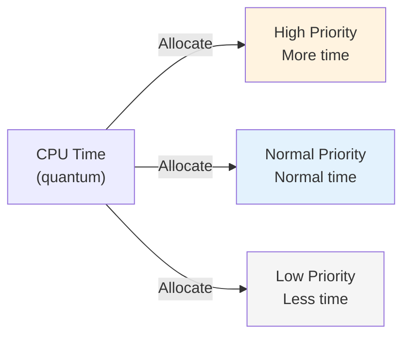

# 06 · Thread Priority, Daemon & Thread Groups

> **Level:** Beginner
>
> **Pre-reading:** [04 · Thread Creation & Lifecycle](04-thread-creation.md)

---

## Daemon Threads (Revisited in Depth)

Daemon threads are "background threads" of lower importance. The JVM **exits immediately** if only daemon threads remain.

### Setting Daemon Status

```java
Thread thread = new Thread(() -> {
    System.out.println("Running");
});

thread.setDaemon(true);   // Must call BEFORE start()
thread.start();

// After start(), daemon status is set
System.out.println("Is Daemon: " + thread.isDaemon());  // true
```

### Important Rules

❌ **Cannot set daemon after start()** — throws exception:
```java
thread.start();
thread.setDaemon(true);  // ❌ IllegalThreadStateException
```

✅ **Check if thread is daemon**:
```java
if (thread.isDaemon()) {
    System.out.println("This is a background thread");
}
```

### Daemon vs Non-Daemon Behavior

**Non-Daemon (Default):**
```java
Thread nonDaemon = new Thread(() -> {
    for (int i = 0; i < 5; i++) {
        System.out.println("Working " + i);
        try { Thread.sleep(500); } catch (InterruptedException e) {}
    }
});
nonDaemon.start();

System.out.println("Main finished");
// Output:
// Working 0
// Main finished
// (JVM waits for nonDaemon)
// Working 1, 2, 3, 4
```

**Daemon:**
```java
Thread daemon = new Thread(() -> {
    for (int i = 0; i < 5; i++) {
        System.out.println("Working " + i);
        try { Thread.sleep(500); } catch (InterruptedException e) {}
    }
});
daemon.setDaemon(true);
daemon.start();

System.out.println("Main finished");
// Output:
// Working 0
// Main finished
// (JVM exits immediately, daemon terminates)
```

### Use Cases

✅ **Good for daemon threads:**

- Background cleanup tasks
- Periodic health checks
- Log flushing
- Metrics collection

❌ **Bad for daemon threads:**

- File I/O that must complete
- Network requests needing response
- Database writes
- Any operation requiring cleanup

---

## Thread Groups (Legacy)

`ThreadGroup` is a **legacy feature** for organizing related threads. Mostly superseded by ExecutorService.

### Creating Thread Groups

```java
ThreadGroup group = new ThreadGroup("workers");

Thread t1 = new Thread(group, () -> {
    System.out.println("Thread 1 in group");
});

Thread t2 = new Thread(group, () -> {
    System.out.println("Thread 2 in group");
});

t1.start();
t2.start();
```

### Operations on ThreadGroup

```java
ThreadGroup group = new ThreadGroup("workers");

// Create threads in group
new Thread(group, () -> {}).start();
new Thread(group, () -> {}).start();

// Query group
System.out.println("Active threads: " + group.activeCount());

// Stop all threads in group (deprecated)
group.interrupt();

// Set max priority
group.setMaxPriority(Thread.MAX_PRIORITY - 2);
```

### Why ThreadGroup is Deprecated

- ❌ Complex exception handling
- ❌ Thread.stop() related to ThreadGroup was deprecated
- ❌ ExecutorService is superior for modern Java
- ✅ Still exists but rarely used

### Modern Alternative: ExecutorService

```java
// Instead of ThreadGroup, use ExecutorService
ExecutorService executor = Executors.newFixedThreadPool(10);

// Submit tasks
for (int i = 0; i < 100; i++) {
    executor.submit(() -> doTask());
}

// Better control than ThreadGroup
executor.shutdown();
executor.awaitTermination(10, TimeUnit.SECONDS);
executor.shutdownNow();  // Force shutdown
```

---

## Thread Priority (Detailed)

### How Priority Affects Scheduling



### Setting Priority

```java
// Default: 5
System.out.println("Main thread priority: " + Thread.currentThread().getPriority());
// Output: 5

// Adjust
Thread working = new Thread(() -> {
    // CPU-intensive work
});
working.setPriority(9);  // High priority

Thread io = new Thread(() -> {
    // I/O-bound wait
});
io.setPriority(1);  // Low priority
```

### Priority on Different OS

⚠️ **Critical Warning**: Priority behavior differs by operating system

| OS | Behavior |
|:---|:---------|
| **Linux** | Best-effort scheduling, not guaranteed |
| **Windows** | Maps to Windows priority levels |
| **Mac** | Similar to Linux |

### Do NOT Rely on Priority for Correctness

```java
// ❌ WRONG: Assuming priority order
Thread urgent = new Thread(() -> transaction1());
Thread normal = new Thread(() -> transaction2());

urgent.setPriority(Thread.MAX_PRIORITY);
normal.setPriority(Thread.MIN_PRIORITY);

urgent.start();
normal.start();

// No guarantee which finishes first!
// Use synchronization instead
```

---

## Thread Names for Debugging

### Setting Names

```java
Thread thread = new Thread(() -> {
    System.out.println("I am: " + Thread.currentThread().getName());
});

thread.setName("database-worker-1");
thread.start();

// Output: I am: database-worker-1
```

### Helpful Naming Convention

```java
// Format: descriptive-name-{number}
for (int i = 0; i < 10; i++) {
    Thread worker = new Thread(() -> doTask());
    worker.setName("io-handler-" + i);
    worker.start();
}

// vs anonymous names: "Thread-0", "Thread-1", "Thread-2"
```

---

## Key Takeaways

| Concept | Key Point |
|:--------|:----------|
| **Daemon threads** | JVM exits immediately if only daemons remain |
| **Set daemon before start()** | After start() throws exception |
| **Priority** | Is a hint, not guaranteed |
| **ThreadGroup** | Legacy; use ExecutorService instead |
| **Thread names** | Essential for debugging multi-threaded logs |

---

## 📚 Read the Original Blog Post

For more details and examples, read:

- **[Theory & Fundamentals](https://nitinkc.github.io/java/multithreading/concurrency/theory-and-fundamentals/)** — Thread priority and daemon threads

---

??? question "What happens if I set daemon=true after the thread starts?"
    It throws `IllegalThreadStateException`. Daemon status must be set before calling start().

??? question "Can I rely on thread priority for critical operations?"
    No. Priority is OS-dependent and not guaranteed. Use synchronization and explicit coordination for critical operations.

??? question "Should I use ThreadGroup?"
    No, it's legacy. Use ExecutorService for managing groups of threads in modern Java.

---
