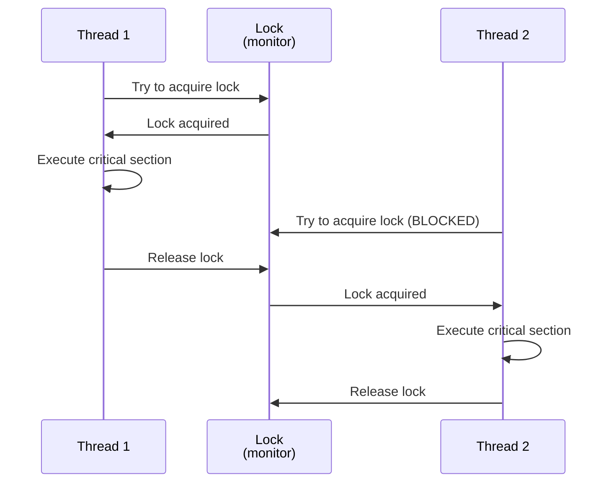
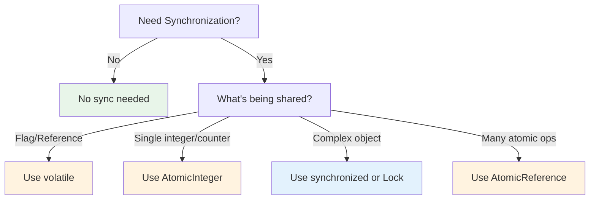

# 08 · Synchronization Mechanisms (synchronized, volatile, AtomicVariables)

> **Level:** Intermediate
>
> **Pre-reading:** [07 · Race Conditions](07-race-conditions.md) · [02 · Memory Model](02-memory-model.md)

---

## synchronized Keyword

### synchronized Block

```java
synchronized (lock) {
    // Critical section
    // Only one thread can execute here at a time
}
```

### synchronized Method

```java
class Counter {
    private int count = 0;
    
    // Instance method — lock is `this`
    synchronized void increment() {
        count++;
    }
    
    // Static method — lock is the Class object
    static synchronized void staticIncrement() {
        // ...
    }
}

// Equivalent to:
class CounterExplicit {
    private int count = 0;
    
    void increment() {
        synchronized (this) {  // Lock is `this`
            count++;
        }
    }
    
    static void staticIncrement() {
        synchronized (Counter.class) {  // Lock is Class object
            // ...
        }
    }
}
```

### How synchronized Works



### Guarantees

1. **Mutual exclusion**: Only one thread in critical section
2. **Visibility**: Changes visible to next thread that acquires lock
3. **Atomicity**: Critical section executes without interruption

### Fine vs Coarse Grained

**Coarse (whole object locked):**
```java
class Account {
    private int balance = 1000;
    
    synchronized void withdraw(int amount) {
        balance -= amount;
    }
    
    synchronized void deposit(int amount) {
        balance += amount;
    }
    
    synchronized void transfer(Account other, int amount) {
        // Long operation with both balances locked
        withdraw(amount);
        other.deposit(amount);
    }
}
```

**Fine-Grained (separate locks):**
```java
class Account {
    private int balance = 1000;
    private final Object balanceLock = new Object();
    
    void withdraw(int amount) {
        synchronized (balanceLock) {
            balance -= amount;  // Short critical section
        }
    }
    
    void deposit(int amount) {
        synchronized (balanceLock) {
            balance += amount;
        }
    }
}
```

---

## volatile Keyword

### What volatile Does

```java
private volatile int x = 0;  // Ensures visibility across threads
```

**Effects:**

- ✅ Ensures writes are immediately visible to other threads
- ✅ Prevents instruction reordering
- ❌ Does NOT provide atomicity
- ❌ Does NOT provide mutual exclusion

### volatile vs synchronized

| Feature | volatile | synchronized |
|:--------|:---------|:------------|
| **Visibility** | ✅ | ✅ |
| **Atomicity** | ❌ | ✅ |
| **Mutual Exclusion** | ❌ | ✅ |
| **Overhead** | Low | High (lock) |
| **Use Case** | Flags, references | Shared mutable data |

### When to Use volatile

```java
// ✅ Good: Flag or status variable
class Task {
    private volatile boolean cancelled = false;
    
    void cancel() {
        cancelled = true;
    }
    
    void run() {
        while (!cancelled) {
            doWork();
        }
    }
}

// ❌ Wrong: Counters
class Counter {
    private volatile int count = 0;
    
    void increment() {
        count++;  // Still NOT atomic!
        // Use AtomicInteger instead
    }
}
```

---

## Atomic Variables

### AtomicInteger

```java
import java.util.concurrent.atomic.AtomicInteger;

class Counter {
    private AtomicInteger count = new AtomicInteger(0);
    
    void increment() {
        count.incrementAndGet();  // Atomic
    }
    
    int getCount() {
        return count.get();  // Atomic
    }
}
```

### Common Atomic Types

| Type | Use Case |
|:-----|:---------|
| `AtomicInteger` | Integer counter |
| `AtomicLong` | Long counter, timestamps |
| `AtomicBoolean` | Atomic boolean flag |
| `AtomicReference<T>` | Atomic reference to object |
| `AtomicIntegerArray` | Thread-safe array |

### Compound Operations

```java
AtomicInteger count = new AtomicInteger(0);

// Atomic operations
count.incrementAndGet();        // ++
count.decrementAndGet();        // --
count.addAndGet(5);            // += 5
count.getAndSet(10);           // Get old, set new
count.compareAndSet(10, 20);   // CAS (if 10, then set 20)
```

### CAS (Compare-And-Swap)

```java
AtomicInteger count = new AtomicInteger(5);

// CAS: if current == 5, set to 10
boolean success = count.compareAndSet(5, 10);
System.out.println(success);  // true

// Try again
success = count.compareAndSet(5, 10);
System.out.println(success);  // false (current is now 10)
```

### Performance: Atomic vs synchronized

```java
// Atomic — uses CAS (no lock contention)
AtomicInteger counter = new AtomicInteger();
for (int i = 0; i < 1_000_000; i++) {
    counter.incrementAndGet();  // Fast, lock-free
}

// vs

// Synchronized — uses lock (potential contention)
int count = 0;
synchronized (lock) {
    for (int i = 0; i < 1_000_000; i++) {
        count++;  // Slower, lock overhead
    }
}
```

**Atomic wins on high contention** (many threads competing).

---

## Choosing Synchronization Mechanism



---

## Key Takeaways

| Mechanism | Atomicity | Visibility | Overhead | Use Case |
|:----------|:----------|:-----------|:---------|:---------|
| **synchronized** | ✅ | ✅ | High | General shared data |
| **volatile** | ❌ | ✅ | Low | Flags, status |
| **Atomic** | ✅ | ✅ | Low | Single values, counters |

---

## 📚 Read the Original Blog Post

For more details and examples, read:

- **[Synchronization Mechanisms](https://nitinkc.github.io/java/multithreading/concurrency/synchronization-mechanisms/)** — synchronized, volatile, and atomic operations

---

??? question "When should I use volatile instead of synchronized?"
    When you only need visibility without mutual exclusion. Example: boolean flags, reference updates. For compound operations, use AtomicInteger or synchronized.

??? question "Are Atomic variables faster than synchronized?"
    On high contention (many threads competing), yes. Atomic uses lock-free CAS operations. On low contention, synchronized can be faster due to lock optimization.

??? question "What happens if I increment an AtomicInteger twice rapidly?"
    Both increments happen atomically in order. The second increment is guaranteed to see the result of the first. Always atomic.

---
