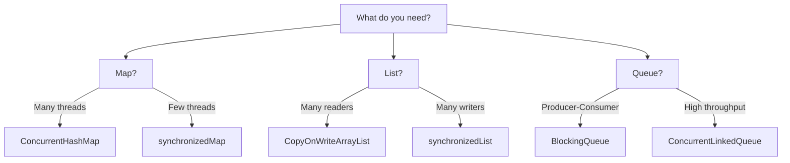

# 12 · Concurrent Collections & BlockingQueues

> **Level:** Intermediate
>
> **Pre-reading:** [08 · Synchronization Mechanisms](08-synchronization.md)

---

## ConcurrentHashMap

### Problem with HashMap + synchronized

```java
// ❌ Inefficient: entire map locked
Map<String, String> map = Collections.synchronizedMap(new HashMap<>());

// All threads wait even if accessing different keys!
```

### ConcurrentHashMap Solution

```java
// ✅ Efficient: only segment locked
ConcurrentHashMap<String, String> map = new ConcurrentHashMap<>();

// Threading into 16 segments by default
// Multiple threads can write to different segments simultaneously
map.put("key1", "value1");  // Threads can write concurrently
map.get("key1");            // Reads are lock-free (mostly)
```

### Operations

```java
ConcurrentHashMap<String, Integer> map = new ConcurrentHashMap<>();

// Basic operations
map.put("count", 1);
map.get("count");

// Atomic compound operations
map.putIfAbsent("count", 0);
map.compute("count", (k, v) -> v == null ? 1 : v + 1);
map.computeIfAbsent("count", k -> 0);

// Iteration is thread-safe (weakly consistent)
for (String key : map.keySet()) {
    System.out.println(key);
}
```

### Weak Consistency

```java
ConcurrentHashMap<String, Integer> map = new ConcurrentHashMap<>();

map.put("a", 1);
map.put("b", 2);

// Iteration doesn't lock entire map
// May see some updates made during iteration, not others
Iterator<String> it = map.keySet().iterator();
while (it.hasNext()) {
    String key = it.next();
    if (key.equals("a")) {
        map.put("c", 3);  // OK: doesn't cause ConcurrentModificationException
    }
}
```

---

## CopyOnWriteArrayList

### Use Case

Many readers, few writers.

```java
// ❌ synchronized list: all reads are slow
List<String> list = Collections.synchronizedList(new ArrayList<>());

// ✅ CopyOnWriteArrayList: reads are fast
List<String> list2 = new CopyOnWriteArrayList<>();

// Reads use latest snapshot (no lock)
for (String item : list2) {
    System.out.println(item);  // Fast
}

// Writes copy entire array (expensive)
list2.add("new");  // Slow, but only one writer at a time
```

### Behavior

```java
CopyOnWriteArrayList<String> list = new CopyOnWriteArrayList<>();

list.add("a");
list.add("b");

// Iteration on SNAPSHOT
Iterator<String> it = list.iterator();

// Doesn't interfere with iteration
list.add("c");  // Creates new copy, iteration continues on old snapshot
```

---

## BlockingQueue

### Use Case

Producer-consumer pattern.

```java
import java.util.concurrent.*;

BlockingQueue<String> queue = new LinkedBlockingQueue<>(10);  // Bounded

// Producer
new Thread(() -> {
    for (int i = 0; i < 100; i++) {
        try {
            queue.put("item-" + i);  // Blocks if full
        } catch (InterruptedException e) {}
    }
}).start();

// Consumer
new Thread(() -> {
    while (true) {
        try {
            String item = queue.take();  // Blocks if empty
            System.out.println("Consumed: " + item);
        } catch (InterruptedException e) {}
    }
}).start();
```

### Queue Types

| Type | Behavior |
|:-----|:---------|
| **LinkedBlockingQueue** | Unbounded (or bounded) |
| **ArrayBlockingQueue** | Fixed-size array-backed |
| **PriorityBlockingQueue** | Elements ordered by priority |
| **SynchronousQueue** | No internal storage, direct hand-off |

---

## Other Concurrent Collections

### ConcurrentLinkedQueue

```java
// Lock-free, unbounded queue
ConcurrentLinkedQueue<String> queue = new ConcurrentLinkedQueue<>();

queue.offer("item1");  // Add
String item = queue.poll();  // Remove (or null if empty)
```

### ConcurrentSkipListMap

```java
// Lock-free, sorted map
ConcurrentSkipListMap<String, Integer> map = new ConcurrentSkipListMap<>();

map.put("b", 2);
map.put("a", 1);

// Iterate in sorted order
for (String key : map.keySet()) {
    System.out.println(key);  // a, b (sorted)
}
```

---

## Choosing Collection



---

## Key Takeaways

| Collection | Thread Safety | Use Case |
|:-----------|:-------------|:---------|
| **ConcurrentHashMap** | Partial locking | Many readers & writers |
| **CopyOnWriteArrayList** | Lock-free reads | Many readers, few writers |
| **BlockingQueue** | Full locking | Producer-consumer |
| **ConcurrentLinkedQueue** | Lock-free | High throughput queue |

---

## 📚 Read the Original Blog Post

For more details and examples, read:

- **[Concurrent Collections](https://nitinkc.github.io/java/multithreading/concurrency/09-concurrent-collections/)** — Thread-safe data structures

---

??? question "When should I use synchronizedList instead of CopyOnWriteArrayList?"
    synchronizedList is better for balanced read/write. CopyOnWriteArrayList is better for heavy reads, light writes.

??? question "What happens if I iterate and modify a CopyOnWriteArrayList?"
    You won't get ConcurrentModificationException. Modifying creates a new copy; your iteration continues on the old snapshot.

??? question "Why would I choose SynchronousQueue?"
    For direct hand-off between producer and consumer threads with no buffering; good for thread pool work queues.

---
