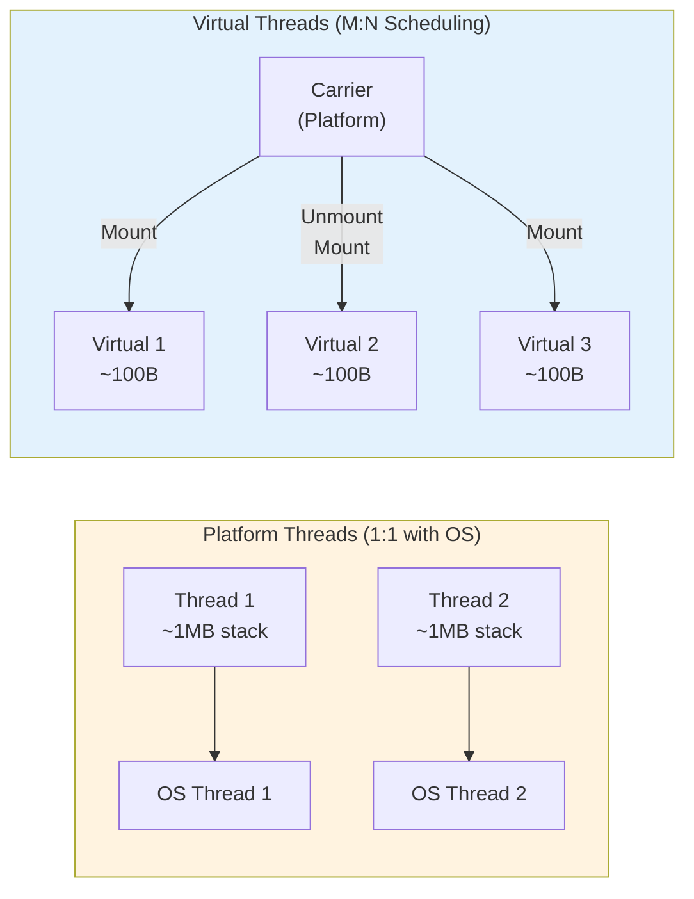
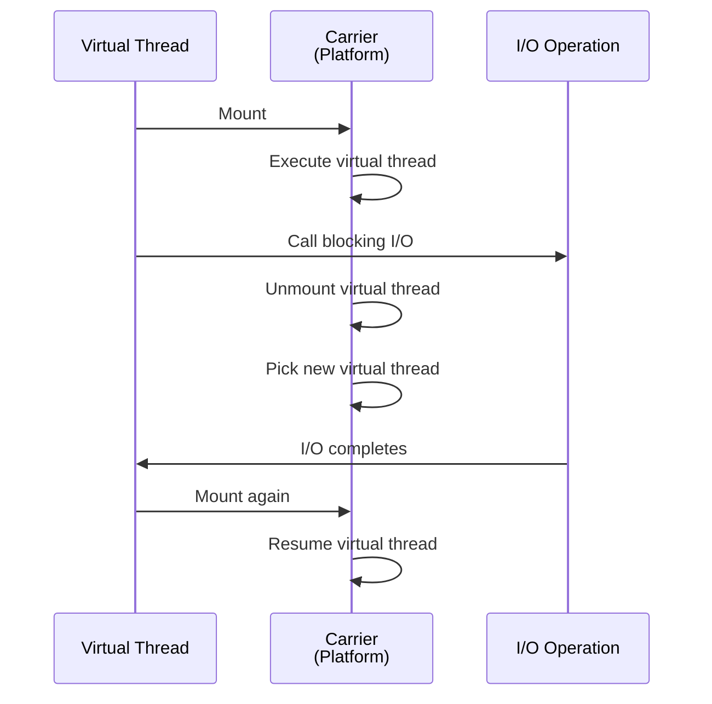

# 13 · Virtual Threads (Project Loom)

> **Level:** Advanced
>
> **Pre-reading:** [03 · I/O Types & Thread Preemption](03-io-and-preemption.md) · [10 · Executor Framework](10-executor-framework.md)
>
> **Requires:** Java 21+

---

## Platform vs Virtual Threads

### Platform Threads (Traditional)

```java
Thread thread = new Thread(() -> {
    System.out.println("Platform thread");
});
thread.start();
```

**Characteristics:**

- 1:1 mapping to OS threads
- ~1MB stack per thread
- Expensive to create
- Limited to thousands
- Full OS scheduling overhead

### Virtual Threads (Java 21+)

```java
Thread vthread = Thread.ofVirtual().start(() -> {
    System.out.println("Virtual thread");
});

// Or lambda shorthand
Thread vthread2 = Thread.startVirtualThread(() -> {
    System.out.println("Virtual thread 2");
});
```

**Characteristics:**

- M:N mapping (many virtual on few platform threads)
- ~100 bytes memory footprint
- Cheap to create (millions possible)
- JVM-managed scheduling (no OS context switch)
- **Mount/unmount** on carrier threads

### Comparison



---

## Creating Virtual Threads

### Direct Creation

```java
// Named virtual thread
Thread vthread = Thread.ofVirtual()
    .name("my-vthread")
    .start(() -> {
        System.out.println("Running in: " + Thread.currentThread().getName());
    });

// Unnamed
Thread vthread2 = Thread.startVirtualThread(() -> {
    System.out.println("Unnamed virtual thread");
});
```

### Virtual Thread Executor

```java
// Best practice: use executor
try (var executor = Executors.newVirtualThreadPerTaskExecutor()) {
    for (int i = 0; i < 10000; i++) {
        executor.submit(() -> {
            // Each task runs in its own virtual thread
            blockingIoTask();  // Can block safely
        });
    }
}  // Executor auto-shuts down
```

---

## How Virtual Threads Work

### Mount and Unmount



### Blocking Operations Mount/Unmount

```java
try (var executor = Executors.newVirtualThreadPerTaskExecutor()) {
    for (int i = 0; i < 5; i++) {
        executor.submit(() -> {
            try {
                // Blocking I/O — virtual thread unmounts
                Socket socket = new Socket("example.com", 80);
                InputStream input = socket.getInputStream();
                byte[] buffer = new byte[1024];
                input.read(buffer);  // Blocks — unmounts from carrier
                // Carrier available for other virtual threads
                
                System.out.println("Data received");
            } catch (IOException e) {}
        });
    }
}
```

### CPU-Bound Work (NOT Ideal)

```java
try (var executor = Executors.newVirtualThreadPerTaskExecutor()) {
    for (int i = 0; i < 10000; i++) {
        executor.submit(() -> {
            // CPU-intensive work — does NOT unmount
            // Virtual thread stays mounted entire time
            // No benefit over platform thread
            long sum = 0;
            for (long j = 0; j < 1_000_000_000L; j++) {
                sum += j;
            }
            System.out.println(sum);
        });
    }
}
```

**Key Point:** Virtual threads are for I/O-bound, not CPU-bound.

---

## Virtual Threads ≠ Always Faster

### I/O-Bound (Virtual Wins)

```java
// Platform threads: need 1000 threads = ~1GB RAM
ExecutorService executor = Executors.newFixedThreadPool(1000);
for (int i = 0; i < 1000000; i++) {
    executor.submit(() -> {
        httpRequest();  // Blocking I/O
    });
}

// Virtual threads: need 1 executor, millions of tasks cheap
try (var executor = Executors.newVirtualThreadPerTaskExecutor()) {
    for (int i = 0; i < 1000000; i++) {
        executor.submit(() -> {
            httpRequest();  // Same code, scales to millions
        });
    }
}
```

### CPU-Bound (No Advantage)

```java
// Platform: 4 threads on 4-core CPU = good
ExecutorService pool = Executors.newFixedThreadPool(4);
for (int i = 0; i < 4; i++) {
    pool.submit(() -> {
        cpuIntensiveWork();  // Runs in parallel on 4 cores
    });
}

// Virtual: 10000 virtual threads on 4-core CPU = worse
// Only 4 cores available; virtual threads add scheduling overhead
try (var executor = Executors.newVirtualThreadPerTaskExecutor()) {
    for (int i = 0; i < 10000; i++) {
        executor.submit(() -> {
            cpuIntensiveWork();  // Still only 4 cores; now with JVM scheduling
        });
    }
}
```

---

## Thread Local with Virtual Threads

### ThreadLocal Caveat

```java
// ThreadLocal still works, but behavior changes
ThreadLocal<String> threadLocal = new ThreadLocal<>();

try (var executor = Executors.newVirtualThreadPerTaskExecutor()) {
    for (int i = 0; i < 10; i++) {
        final int taskId = i;
        executor.submit(() -> {
            threadLocal.set("task-" + taskId);
            String value = threadLocal.get();  // Works fine
            System.out.println(value);
        });
    }
}

// Each virtual thread has its own ThreadLocal value
```

### ScopedValue (Preferred for Virtual Threads)

```java
import java.lang.ScopedValue;

// Use ScopedValue instead of ThreadLocal for virtual threads
private static final ScopedValue<String> REQUEST_ID = ScopedValue.newInstance();

try (var executor = Executors.newVirtualThreadPerTaskExecutor()) {
    for (int i = 0; i < 10; i++) {
        final int taskId = i;
        executor.submit(() -> {
            // Scoped to this virtual thread and all called methods
            REQUEST_ID.set("request-" + taskId, () -> {
                String id = REQUEST_ID.get();
                System.out.println(id);
            });
        });
    }
}
```

---

## Debugging Virtual Threads

### Get Thread Info

```java
Thread vthread = Thread.ofVirtual()
    .name("my-task")
    .start(() -> {
        Thread current = Thread.currentThread();
        System.out.println("Name: " + current.getName());
        System.out.println("Virtual: " + current.isVirtual());
        System.out.println("ID: " + current.threadId());
    });
```

### Monitoring

Virtual threads don't show up in traditional thread monitoring tools. Use:
```bash
# Java Flight Recorder
-XX:StartFlightRecording

# jcmd
jcmd <pid> Thread.dump
```

---

## Key Takeaways

- **Virtual threads**: Lightweight JVM-managed threads (millions possible)
- **Use for I/O-bound**: Blocking I/O without thread pool limits
- **Not for CPU-bound**: No advantage; CPU cores still limited
- **No more thread pools needed**: `Executors.newVirtualThreadPerTaskExecutor()`
- **ScopedValue preferred**: Over ThreadLocal for virtual threads

---

## 📚 Read the Original Blog Post

For more details and examples, read:

- **[Virtual Threads](https://nitinkc.github.io/java/multithreading/concurrency/virtual-threads/)** — Project Loom and the future of concurrency

---

??? question "Can I create millions of virtual threads?"
    Yes, but memory is still limited. Millions of virtual threads = millions of stack frames, though smaller.

??? question "Do virtual threads run in parallel on multiple cores?"
    Only if they're doing I/O (unmounting), or if scheduled on different carriers. CPU-bound work still needs parallelism.

??? question "Should I use virtual threads for thread pools now?"
    For I/O-bound services, yes. For CPU-bound, still use fixed-size platform thread pools.

---
